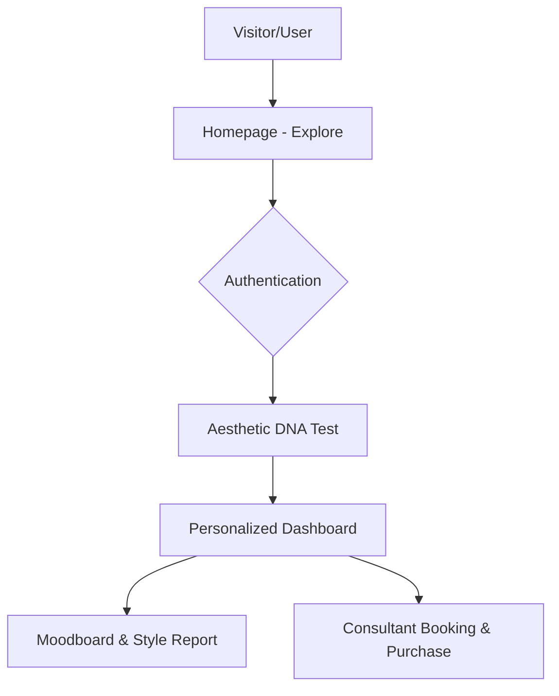

# Asterism

> **將散落的美學，連成屬於你的星座 --**
> *Discover your aesthetic. Build your visual identity.*

---

## 📖 專案概覽

Asterism 是一個結合 AI 推薦、美學 DNA 分析與靈感收藏的生活風格探索平台。我們致力於解決使用者在碎片化資訊時代，難以梳理個人審美偏好、無法建立系統化美學資料庫的痛點。透過圖片盲選建立個人風格輪廓，Asterism 讓你從靈感發掘到風格落地，實現專屬於你的生活美學。

---

## ✨ 核心特色

### 🧬 美學 DNA 分析

透過多輪圖片盲選與交叉分析，建立精準的個人風格座標。

* **美學人格建模**：透過演算法解析個人審美偏好。
* **跨領域映射**：將抽象美學連結至具體的居家、設計領域。

### 🖼️ 沉浸式靈感探索

打造流暢的高效瀏覽體驗。

* **瀑布流與不規則版面**：結合 Lazy Loading 技術，實現大數據量下的極致效能。
* **智慧關鍵字推薦**：利用向量搜尋（Vector Search）提供高度相關的視覺內容。

### ❤️ Moodboard 收藏系統

建立你的個人知識管理（PKM）美學資料庫。

* **標籤與資料夾系統**：結構化整理你的靈感碎片。
* **偏好追蹤**：隨時間演進更新你的風格偏好。

### 🤖 AI 個人化推薦

* **行為分析引擎**：基於 `pgvector` 的相似性搜尋，精準預測使用者下一個靈感視點。

### 🛍️ 風格導購與顧問媒合

從靈感落實為現實，提供無縫的購買連結與專業顧問媒合流程。

---

## 🏗️ 系統架構設計

---

## 📚 文件導覽

| 文件 | 說明 |
|------|------|
| [`docs/ARCHITECTURE.md`](./docs/ARCHITECTURE.md) | 專案架構、目錄結構、設計系統、API 分層與開發規範 |
| [`.github/PULL_REQUEST_TEMPLATE.md`](./.github/PULL_REQUEST_TEMPLATE.md) | Pull Request 提交範本 |

---

## 🛠️ 技術棧 (Tech Stack)

| 類別 | 技術選型 |
| --- | --- |
| **Frontend** |      |
| **Backend** |     |
| **Database** |    |
| **AI/Recommendation** |     |

---

## 🚀 開發路徑 (Roadmap)

* [ ] **Phase 1: 基礎架構與靈感管理** (會員、瀑布流、Moodboard)
* [ ] **Phase 2: 風格剖析引擎** (DNA 測驗、風格報告)
* [ ] **Phase 3: 智慧推薦系統** (AI 相似推薦、標籤搜尋)
* [ ] **Phase 4: 商業化轉化** (顧問媒合、金流整合)

---

## 📄 License

本專案採用 [MIT License](https://opensource.org/license/mit/)。
